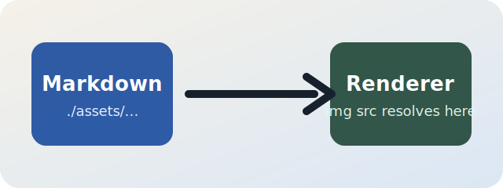

# FreeLook Markdown Image Coverage

This sample exists to verify how the Quick Look preview handles Markdown image references.

## Relative Local Image

The SVG below is referenced relative to this Markdown file and should resolve to `samples/assets/preview-diagram.svg`.

## Remote Image

The image below uses a full HTTPS URL and helps confirm that network-backed images are allowed in the `WKWebView` preview.

## Expected Result

If only the remote image loads, the renderer is fine and the remaining issue is local file access.
If neither image loads, inspect the WebKit page load or content security path.